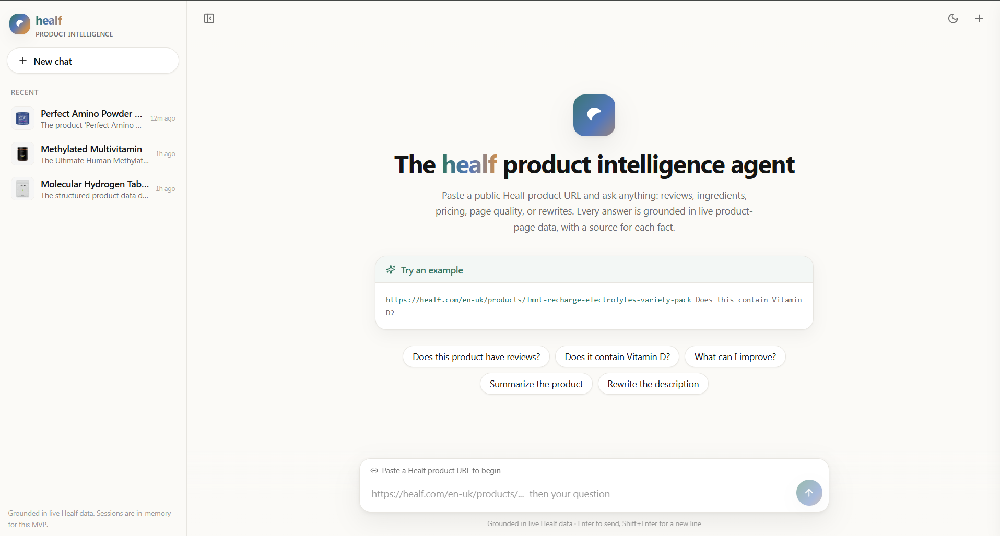
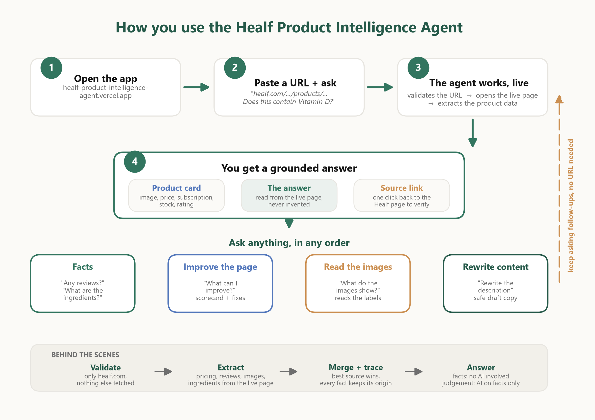

# Healf Product Intelligence Agent

A natural-language agent for Healf product pages. Paste a product URL, ask a question in plain
English, and get an answer grounded in the live page, with a source for every fact. Follow-up
questions reuse the same product and recent conversation, so you never paste the URL twice. It can
also answer compound requests such as "compare the price and reviews, then tell me which signal is
more persuasive" without silently dropping part of the question. Requests for similar or other
products search Healf's live Storefront catalog and return clickable alternatives instead of an
ungrounded generic suggestion. A conversation can also start with a catalogue question such as
"Do you have any protein bars?"; after choosing a result, the same chat continues with grounded
product-page analysis.

**Live demo:** https://healf-product-intelligence-agent.vercel.app
**Walkthrough video:** https://www.loom.com/share/c2abfadb87cb49c6827e10884e086505
_(The backend runs on a free tier that sleeps when idle, so the first request takes 30-60s to wake
up, then it's fast.)_



## Contents

- [The four capabilities](#the-four-capabilities)
- [What you can ask](#what-you-can-ask)
- [How this meets the brief](#how-this-meets-the-brief)
- [How it works](#how-it-works)
- [Quick start](#quick-start)
- [The API](#the-api)
- [Tests](#tests)
- [What's next](#whats-next)
- [Known limitations](#known-limitations)
- [Project layout](#project-layout)

## The four capabilities

The agent is built around the four capabilities in the brief. Each is a separate module, so it's
easy to extend.

1. **Navigate** - given a Healf product URL, it validates the URL and fetches the live page. It
   handles locale paths, `variant` and `selling_plan` query params, redirects, timeouts, and missing
   pages, and it's SSRF-protected (only public `healf.com` hosts, private IPs blocked, host
   re-checked on every redirect). Code: `backend/app/navigation/`.
2. **Ingest** - it extracts and structures the page into one normalized `ProductData`: product text
   and description, reviews (count and rating), images and alt text, pricing (one-time and
   subscription), ingredients, variants, availability, and SEO metadata. Every field keeps evidence
   (which source, an excerpt, a confidence). It can also read the **image content itself** with a
   vision model on request, classifying each image and pulling text off nutrition panels and
   packaging. Code: `backend/app/ingestion/`, `backend/app/intelligence/image_analyzer.py`.
3. **Evaluate** - based on the question, it assesses the relevant parts of the listing: description
   quality, ingredient completeness, review evidence, image coverage, pricing clarity, and SEO. It
   combines deterministic signals (a weighted, labelled-heuristic score) with an LLM that writes the
   narrative and prioritises fixes, grounded in the extracted data and a small live benchmark of
   other Healf products. Code: `backend/app/intelligence/evaluation_rules.py`, `evaluator.py`.
4. **Act on findings** - it produces a useful response: a direct factual answer, a list of issues,
   prioritised recommendations, or improved content (a rewritten description, an FAQ, SEO copy).
   Code: `backend/app/intelligence/factual_answerer.py`, `content_generator.py`, `response_composer.py`.

## What you can ask



Paste a URL, then ask. These are the kinds of questions it handles (including the three from the
brief):

**Factual** - answered straight from the page, no LLM, always with sources:

- Does this product have any reviews?
- Does this product have Vitamin D in it?
- What are the ingredients?
- What's the price on subscription vs one-time?
- Is it in stock?

**Evaluate the listing** - a deterministic score, then the LLM prioritises the fixes:

- What can I improve on this page?
- How is the SEO?

**Read the images** - vision analysis of the actual image content, not just the URLs:

- What do the product images show?
- Are the images good enough?
- Is there a nutrition-facts image? (it reads panels and packaging text)

**Generate content** - grounded only in the page's actual facts:

- Rewrite the product description.
- Write an FAQ for this product.

**Discover related products** - searched in Healf's live catalog:

- Do you have any protein bars? (works before selecting a product URL)
- Can you suggest me other products?
- Show me similar items.
- Recommend some magnesium products instead.

Every answer carries a source line linking to the live product page it was read from. Real
captured responses to these prompts are in
[examples/example_outputs.md](examples/example_outputs.md), so you can review output without running
anything. The capture includes 11 scenarios, including a compound request and a contextual
follow-up that depends on the previous answer.

## How this meets the brief

- **Live data only.** Everything comes from the live `healf.com` page fetched on each request. There
  is no pre-provided or static dataset. The optional benchmark is also generated from live pages.
- **At least one LLM capability.** Evaluation reasoning and all content generation use the LLM.
  Factual lookups are deliberately deterministic (and work with no API key at all).
- **Natural-language interface.** A chat UI: give it a URL and ask in plain English. It extracts the
  URL from your message, and follow-ups don't need it again.

## How it works

```
chat UI (Next.js)
  -> FastAPI: validate URL + SSRF check -> fetch the live page
  -> parsers -> merge into one ProductData (every field keeps its source)
  -> route simple facts deterministically; use recent dialogue for ambiguous/compound questions
  -> stream back over SSE (status -> product -> tokens -> done)
```

Three decisions worth calling out:

**Getting structured data out of Healf.** Healf runs on Shopify but through a headless Next.js
frontend, so the obvious `/products/{handle}.json` just returns HTML. The real data lives in three
places and it parses all of them: the Shopify product object embedded in React Server Component
payloads (`self.__next_f.push(...)`) for variants/pricing/subscriptions/images, a JSON-LD block for
reviews and rating, and Radix accordions in the HTML for description/ingredients/usage. A merger
combines them by a precedence order and keeps evidence for every field, which is what the evidence
drawer shows. (This is the "there is structured data available beyond the page" part of the brief.)

**Deterministic facts, LLM for reasoning.** Facts (ingredients, price, reviews, availability) come
straight from the parsed data, so the LLM can't invent them. The LLM only does open-ended work
(evaluation narrative, summaries, rewrites), and it only ever sees a trimmed dict of facts, never raw
HTML. Ingredient answers even distinguish "not listed on the page" from "doesn't contain it", since
those aren't the same claim.

**Grounded in site context, not a generic checklist.** `scripts/build_benchmark.py` samples a
handful of live products into a benchmark (median description length, image count, alt-text coverage,
and so on), so evaluation can say "add one more image to match comparable pages" instead of a generic
tip. Without the benchmark file, evaluation stays product-specific and says so.

**Conversational without giving up grounding.** The browser sends the last completed user and
assistant turns with each request, so a reopened chat still understands references such as "why does
that matter?" even if the backend session expired. Multi-part questions retain every detected task.
Deterministic results for price, reviews, ingredients and availability are passed to the LLM as
authoritative tool results. High-risk review judgments and generated claims also have deterministic
output guardrails.

More detail and diagrams are in [docs/architecture.md](docs/architecture.md) and
[docs/DIAGRAMS.md](docs/DIAGRAMS.md).

## Quick start

You need Python 3.12+ and Node 20+ (or skip both with `docker compose up --build`).

**1. Backend**

```bash
cd backend
python -m venv .venv && source .venv/bin/activate   # Windows: .venv\Scripts\activate
pip install -r requirements.txt
cp .env.example .env          # optional: add OPENAI_API_KEY or ANTHROPIC_API_KEY
uvicorn app.main:app --reload --port 8000
```

**2. Frontend** (new terminal)

```bash
cd frontend
npm install
cp .env.example .env.local    # NEXT_PUBLIC_API_BASE_URL=http://localhost:8000
npm run dev
```

Open http://localhost:3000.

Factual questions work with **no API key**. Evaluation and content generation need one: set either
`OPENAI_API_KEY` or `ANTHROPIC_API_KEY` and it auto-detects the provider.

## The API

Four endpoints: `GET /health`, `POST /api/products/fetch`, `POST /api/chat`, and
`POST /api/chat/stream` (SSE: `status` -> `product` -> `token` -> `complete`).
Chat requests may include up to 12 recent `{role, text}` history turns for browser-session recovery.

```bash
curl -X POST localhost:8000/api/chat -H 'content-type: application/json' \
  -d '{"message":"https://healf.com/en-uk/products/lmnt-recharge-electrolytes-variety-pack\nDoes it contain Vitamin D?"}'
```

## Tests

```bash
cd backend && pytest -q       # 115 tests: URL/SSRF, parsers, merger, conversation, grounding, evaluation, API
cd frontend && npm test       # 15 component/history tests
```

Parser tests run against a saved real Healf page so they don't need the network; the API tests mock
the fetch and the LLM.

## What's next

The MVP is deliberately read-only with in-memory state. The three capabilities I'd build next:

1. **Upsell / cross-sell** - recommend what to sell alongside a product (complementary items, the
   subscription upsell, bundles), grounded in a catalogue index so the SKUs are real.
2. **Real persistence** - Postgres for sessions, history, and product snapshots (so answers are
   reproducible and you can diff a page over time), Redis for caching and rate limits.
3. **A feedback loop** - capture which recommendations get applied and their impact, and tune the
   rubric and prompts against real outcomes.

Bigger bets I'd add after that:

- **Buy from the chat.** It already extracts the variant, selling plan, price and stock, so it can
  offer "add to basket", "buy now" or "subscribe and save" inline, handing off to Healf's real
  checkout with the variant and selling plan pre-filled (no card data ever touches the agent).
- **Human in the loop.** Escalate low-confidence or health-sensitive questions to a Healf expert
  instead of guessing; let a human enrich data the agent couldn't extract; and require human approval
  before any generated copy is written back to the store.
- **Shopper intelligence.** Goal-based recommendations ("I want better sleep, is this right for
  me?"), product comparison, allergen and diet answers, and review sentiment.
- **Merchandiser tools.** Bulk audits across a whole collection, brand-consistency checks, and
  shareable evaluation reports.

**For production** you'd also add auth, rate limiting, audit logs, observability, model fallback, and
content moderation for health claims (which matters more than usual for a supplements marketplace),
plus an extraction regression suite (Healf's markup can change).

**In three months:** month one is reliability (persistence, the regression suite, a background
crawler for the benchmark); month two is multimodal (vision over images, nutrition-label OCR,
alt-text generation); month three is where it starts acting (writing drafts back to Shopify Admin
behind human approval, scheduled catalogue audits, launch-readiness checks).

The full version is in [docs/roadmap.md](docs/roadmap.md).

## Known limitations

- Vision runs on demand (when you ask about the images), not indexed for every product up front, and it reads panels rather than doing exhaustive OCR of every label.
- Review count/rating comes from JSON-LD, and the agent can quote the written Yotpo review samples
  embedded in the current product page. It does not paginate through the complete review archive.
- Product/session state is in-memory, so it resets on restart. Recent chats are stored in the browser,
  and the last completed turns are resent to restore conversational context when a thread is reopened.
- Extraction depends on Healf's current markup, so a regression suite over saved pages is the first
  thing I'd add for production.

## Project layout

```
backend/app/
  navigation/     URL parsing, SSRF validation, the live fetch client
  ingestion/      the six parsers + the merger
  intelligence/   intent routing, factual answers, evaluation, LLM writer, response composer
  context/        in-memory sessions/cache, benchmark loader
frontend/
  components/     chat/, product/, intelligence/, ui/
  lib/            SSE client, types, helpers
docs/             architecture, roadmap, diagrams
examples/         real captured outputs
```

Stack: FastAPI + httpx + BeautifulSoup/lxml + Pydantic v2 on the backend; Next.js (App Router) +
TypeScript + Tailwind on the frontend.
