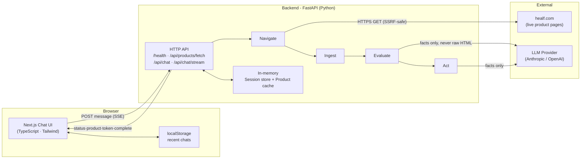
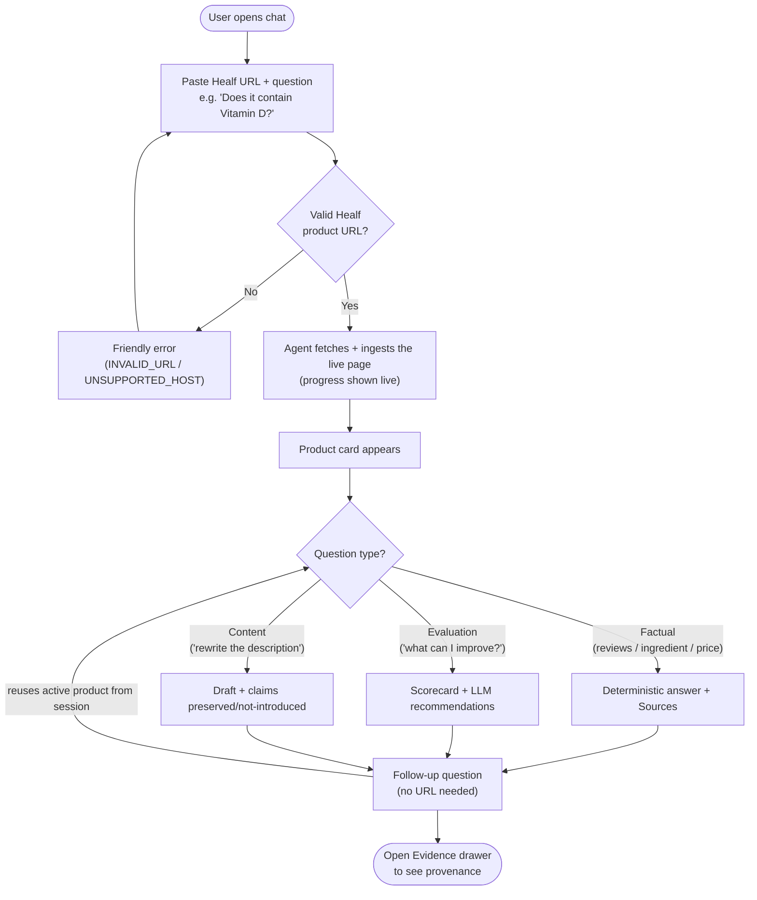
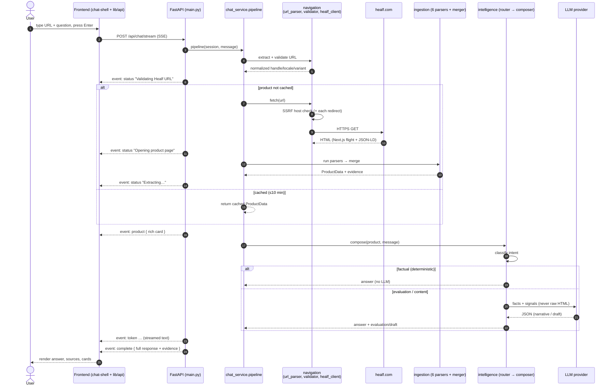
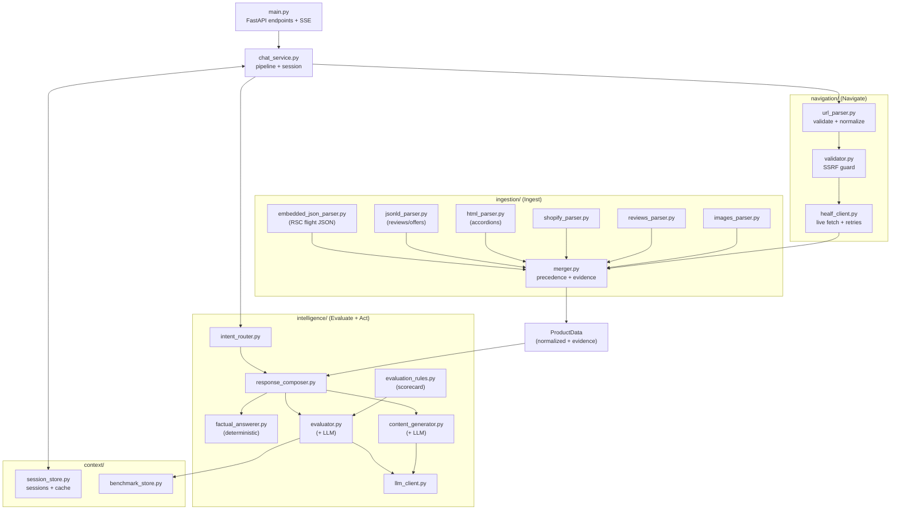
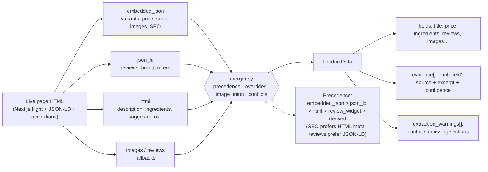
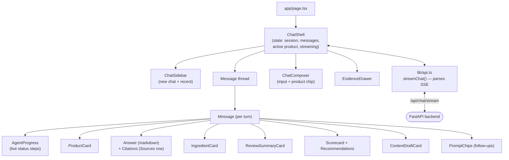
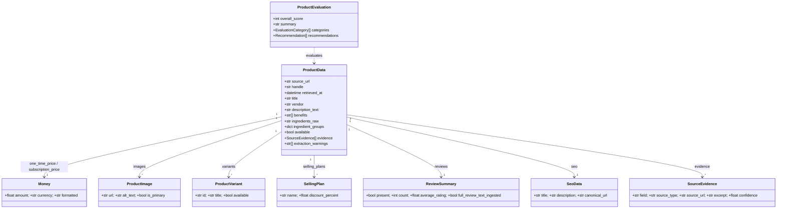

# Diagrams

These are [Mermaid](https://mermaid.js.org/) diagrams; they render on GitHub, in VS Code with the
Markdown Preview Mermaid extension, and in most Markdown viewers.

1. [System / container overview](#1-system--container-overview)
2. [User flow](#2-user-flow)
3. [Request sequence (streaming, end-to-end)](#3-request-sequence-end-to-end)
4. [Backend module architecture](#4-backend-module-architecture)
5. [Ingestion data flow](#5-ingestion-data-flow)
6. [Frontend component tree](#6-frontend-component-tree)
7. [Data model](#7-data-model)

---

## 1. System / container overview

The big picture: a browser talking to a FastAPI backend, which talks to two external systems
(the live Healf site and an LLM provider). No database — state is in memory.

---

## 2. User flow

What a user actually does, and how the agent responds. Note the follow-up loop needs **no URL**.

---

## 3. Request sequence (end-to-end)

The full lifecycle of one streamed message, across every layer. This is the diagram to show when
asked *"what happens when I hit send?"*

---

## 4. Backend module architecture

The four capabilities as isolated layers (this is the "distinct capabilities / easy to extend"
answer). Each box is a real folder/file.

---

## 5. Ingestion data flow

How raw HTML becomes one normalized product. The **merger** is the key: many sources in, one
authoritative value per field out, with evidence and conflict tracking.

---

## 6. Frontend component tree

---

## 7. Data model

The core `ProductData` and the evidence that grounds every field.

