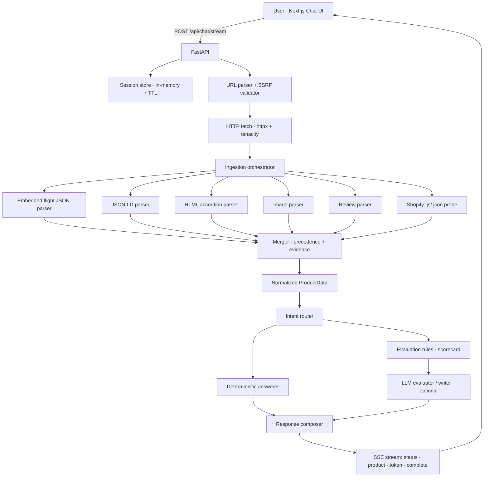

# Architecture

Two services: a FastAPI backend (Python 3.12) that does the navigating, ingesting, evaluating and
answering, and a Next.js frontend (App Router, TypeScript, Tailwind) that's the chat UI and streams
the responses. State is deliberately ephemeral - in-memory sessions (60 min TTL) and a product cache
(10 min TTL), no database or vector store.



## Why ingestion is the way it is

Healf runs on Shopify but through a headless Next.js frontend, not a Liquid theme, and that changes
everything about how you get the data. What I found poking at live pages:

| What you'd assume (classic Shopify) | What Healf actually does |
|---|---|
| `/products/{handle}.js` returns product JSON | Returns the Next.js app HTML - 200 or 404, never JSON |
| Product data sits in Liquid-rendered HTML | It's in React Server Component flight payloads (`self.__next_f.push(...)`) |
| One JSON-LD block, maybe | One JSON-LD `Product` with `aggregateRating` and a few sample reviews |
| Sections as `<h2>`/`<h3>` headings | Radix UI accordions (`button[aria-controls]` → `div[role=region]`) |

So the flight-JSON parser is the primary source (variants, pricing, selling plans, images, SEO),
JSON-LD gives reviews and rating, and the HTML accordions give description, ingredients and usage.
The `.js`/`.json` probe is still there - it does nothing on Healf but would work on a normal Shopify
store, so it's cheap insurance.

## How the merger picks a value

Default precedence when sources overlap:

```text
shopify_json > embedded_json > json_ld > html > review_widget > derived
```

With a few per-field exceptions: SEO and canonical prefer the HTML `<meta>` tags, reviews prefer the
JSON-LD `aggregateRating`, and ingredients/benefits/usage prefer the HTML sections. Images are a
special case - they get unioned across sources and deduped by canonical URL rather than one source
winning. Every field that ends up on the product keeps a `SourceEvidence` record (source, URL,
excerpt, selector, confidence), and when two sources disagree the merger keeps one value, drops the
confidence, and adds an extraction warning.

## Deterministic vs LLM

Anything factual runs without the model: URL validation, all the ingestion, ingredient lookup (with
an alias map), reviews, price, subscription, availability, image count, and the weighted scorecard.
The LLM is optional and only handles the open-ended work - the evaluation narrative and ranked
recommendations, summaries, general questions, and content generation. With no key set, evaluation
and summary fall back to rule-based output and content generation just says it's unavailable.

The LLM only ever sees a compact fact payload (`llm_payload.py`), never raw HTML, and the prompts
(`prompts/`) tell it not to invent facts.

## What happens on one streamed request

1. Validate the URL (from `product_url` or extracted from the message) and run the SSRF check.
2. Fetch the live page, cache-first, re-checking the host on each redirect.
3. Run all the parsers, merge into `ProductData`, cache it.
4. Emit the `product` event so the UI can show the card.
5. Route the intent to a deterministic answer and/or the LLM, then compose the response.
6. Stream the answer as `token` events, then a final `complete` with the full response.

Follow-up messages leave out the URL and reuse whatever product the session is holding.
