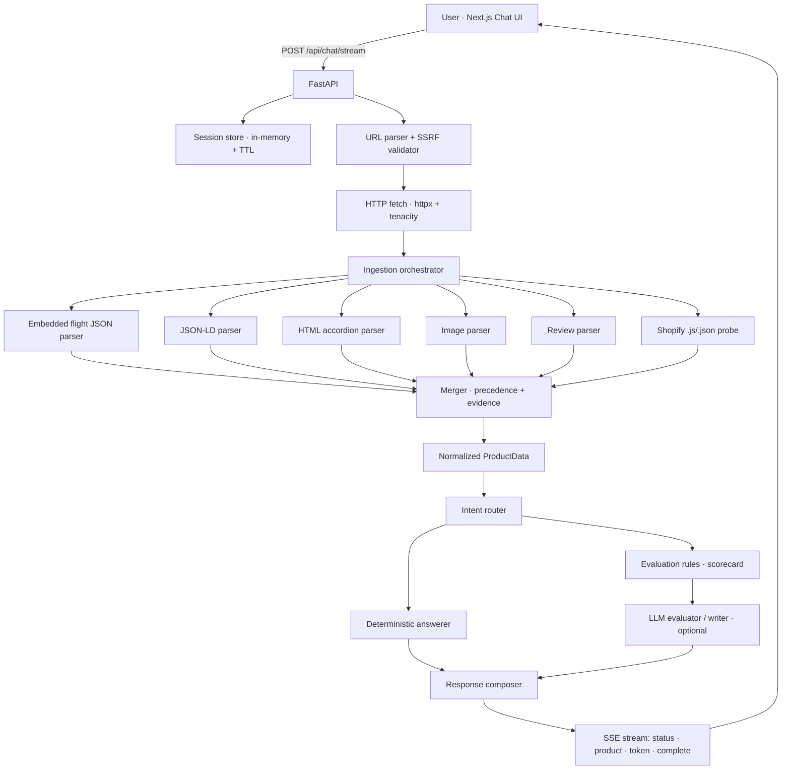

# Architecture

## Overview

The Healf Product Intelligence Agent is a **two-service** application:

- **`backend/`** — FastAPI (Python 3.12) that navigates, ingests, evaluates, and answers.
- **`frontend/`** — Next.js (App Router, TypeScript, Tailwind) chat UI that streams responses.

State is intentionally ephemeral for the MVP: in-memory sessions (60 min TTL) and an
in-memory product cache (10 min TTL). No database, no vector store, no auth.



## Why Healf needs a bespoke ingestion strategy

Healf.com is a **headless Next.js storefront** (Shopify Storefront API behind a custom
frontend), not a classic Shopify Liquid theme. Consequences discovered from live pages:

| Assumption (classic Shopify) | Reality on Healf |
|---|---|
| `/products/{handle}.js` returns product JSON | Returns the Next.js app HTML (HTTP 200/404, never product JSON) |
| Product data in Liquid-rendered HTML | Data ships in React Server Component **flight payloads** (`self.__next_f.push(...)`) |
| One JSON-LD block | One JSON-LD `Product` with `aggregateRating` + 10 sample reviews |
| Sections as `<h2>`/`<h3>` | Radix UI **accordions** (`button[aria-controls]` → `div[role=region]`) |

So the **embedded flight-JSON parser** is the primary source (variants, pricing,
selling plans, images, SEO), JSON-LD supplies reviews/rating, and HTML accordions supply
description / ingredients / suggested use. The `.js`/`.json` probe is retained (it works for
real Shopify themes and degrades gracefully to nothing on Healf).

## Source precedence (merger)

```text
shopify_json > embedded_json > json_ld > html > review_widget > derived
```

Per-field overrides: SEO & canonical prefer HTML `<meta>`; reviews prefer JSON-LD
`aggregateRating`; ingredients/benefits/suggested-use prefer HTML sections; images are
**unioned** across sources (deduped by canonical URL). Every populated field keeps a
`SourceEvidence` record (source type, URL, excerpt, selector, confidence). Conflicts add an
extraction warning and lower confidence.

## Deterministic vs. LLM

- **Deterministic** (no LLM): URL validation, ingestion, ingredient lookup (with alias map),
  reviews, price, subscription, availability, image count, and the full weighted scorecard.
- **LLM** (optional): evaluation narrative + prioritized recommendations, product summary,
  open-ended questions, and content generation (rewrite / FAQ / SEO). Missing key ⇒
  rule-based fallback for evaluation/summary; content generation reports it is unavailable.

The LLM only ever receives a **compact fact payload** (`llm_payload.py`) — never raw HTML —
and is instructed not to invent facts (see `prompts/`).

## Request lifecycle (streaming)

1. `validate_url` — parse + SSRF check the URL (from `product_url` or extracted from the message).
2. `fetch_product` / `read_shopify` — live fetch (cache-first), revalidating host on each redirect.
3. `extract` — run all parsers, merge to `ProductData`, cache it.
4. emit `product` event (rich card).
5. `answer` — route intent → deterministic answer and/or LLM → compose.
6. stream `token`s, then `complete` with the full `ChatResponse`.

Follow-up messages omit the URL and reuse the session's active product.
